# Lazy Shortcuts for Minecraft Bedrock
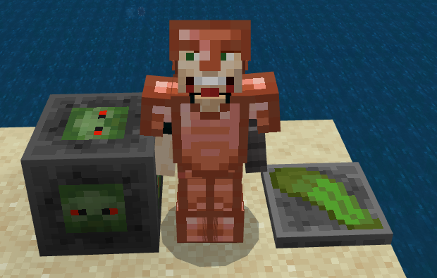

This is an addon that simplifies some things I commonly do in Minecraft.
It's not really meant to change the game so much as simplify the more grindy elements of the game.
## Implemented
### Added Functionality
- **Terminus**: Teleport between locations.
    - 5 craftable types (Copper, Iron, Gold, Emerald, and Diamond).
    - Automatically adds/removes ticking area when placed/removed. **Limit of 10 ticking areas in Bedrock worlds**.
- **Enchanted Totem**: Teleports to nearest enchanting table.
    - Resembles homeward bone from Dark Souls.
- **Lesser Enchanting Table**: Grants low-level enchantments for 4XP levels.
    - Also grants Silk Touch and Fortune 1
- **Greater Enchanting Table**: Grants high-level enchantments for 8XP levels.
    - Also grants Silk Touch and Fortune 2
- **Arcane Enchanting Table**: Grants additional enchantments for 16XP levels.
- **Seeing Stone**: Locates Ruined Portals and Nether Fortresses.
    - Crafting ingredient for the **Arcane Locator**.
- **Arcane Locator**: Gives the coordinates of various structures
    - This will temporarily generate command blocks at the world ceiling, but should be minimally disruptive.
    - For some reason the output of the `locate` command is suppressed when called from an item event or NPC. Hence the hacky command-block implementation.
- **Kelp Generator**: Generates kelp at regular intervals. 
    - Avoid the complexity of zero-tick kelp/XP farms.
- **Zombie Spawner**: Generates zombies at regular intervals.Can only be placed on existing mob spawners.
    - Beefs up the efficiency of mob spawner farms, and works around a 1.18 bug where mob spawners don't work.
- **Boring Wand**: Clears a 3x2x5 space in front of the player. Removes most common blocks (stone, gravel, netherrack, etc).

### Recipes for Existing Stuff
- **Trident Recipe**: `Tridents` are scarce early game and abundant late game. This makes them a bit easier to acquire.
- **Saddle Recipe**: `Saddles` are scarce early game (when you need them) and abundant later (when you don't).
- **Quartz Recipe**: Convert your `quartz_blocks` back into `quartz`! This was a dumb "[feature](https://feedback.minecraft.net/hc/en-us/community/posts/360043032171-Quartz-Block-to-Nether-Quartz)" anyway.
- **Scute Recipe**: Save some time waiting for eggs to hatch and baby turtles to grow.
- **Creeper Spawn Egg**: Turn a mob spawner into your very own gunpowder farm.
- **Zombie Villager Spawn Egg**: Easily build your trading hall, with discounts.
- Smelt leather components down to `rabbit_hide` via furnace.

# Installation
1. Download the latest addon from the [releases page](https://github.com/thebearup/lazy_minecraft_shortcuts/releases)
2. Follow the instructions based on your platform
    - [Windows 10/Android/iPad](https://www.minecraft.net/en-us/addons)
      - The easiest way
    - [Xbox](https://youtu.be/754amkN3dok?t=15)
      - Basically download via the Edge browser and install with [MC Addons Manager](https://www.microsoft.com/en-us/p/mc-addons-manager/9p8r42ntgllt?activetab=pivot:overviewtab)
    - [PS4](https://www.youtube.com/watch?v=BoDSPuH4x_U&ab_channel=AntonyandHarryGames)
      - Push the addon to a world/realm via a supported platform, then connect from your PS4.
    - [Switch](https://gaming.stackexchange.com/questions/384024/how-can-i-add-add-ons-to-my-game-on-the-nintendo-switch)
      - Fairly convoluted - can use the PS4 method instead.
3. Enable `Holiday Creator Features` in world settings.

# New Recipes/Features
|   |   |
|---|---|
|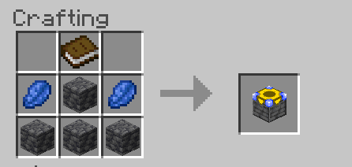|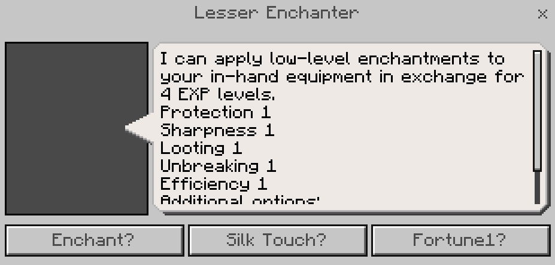|
|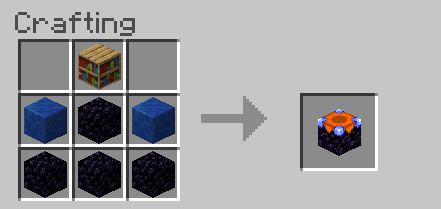|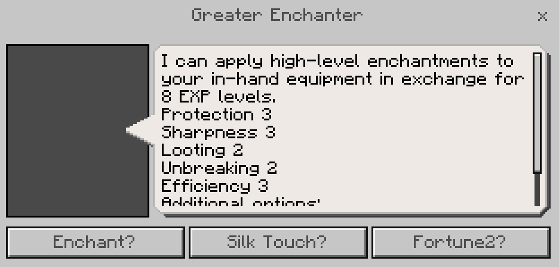|
|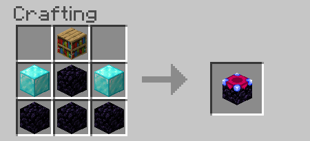||
|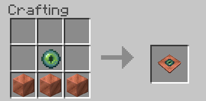|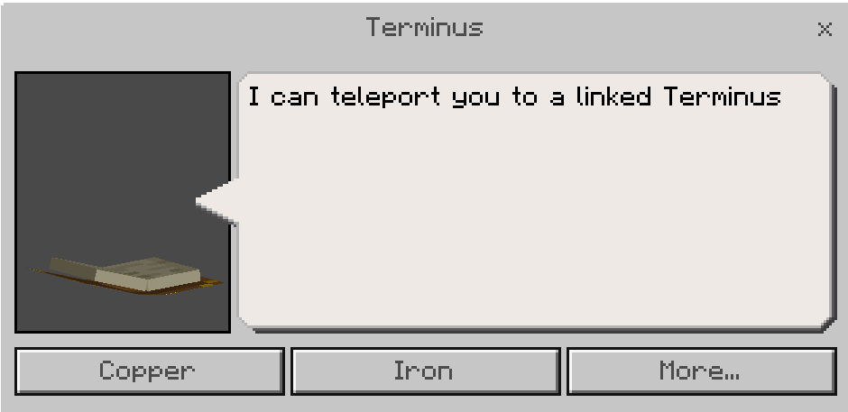|
|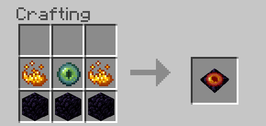|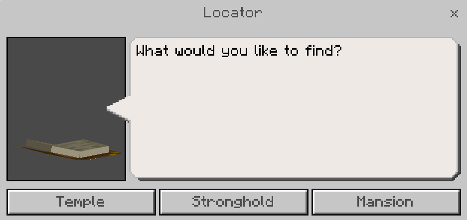|

|   |   |
|---|---|
|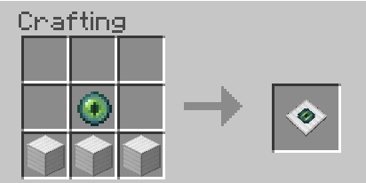|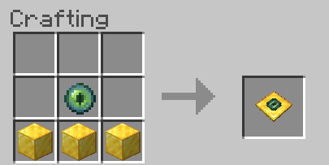|
|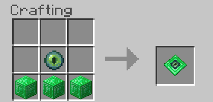|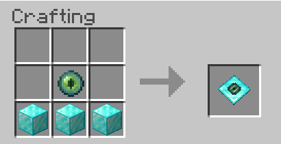|
|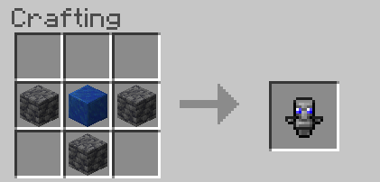|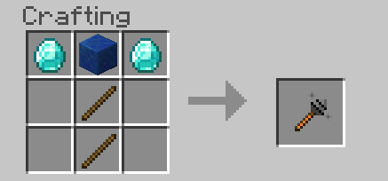|
|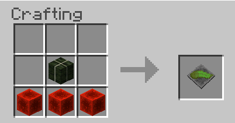|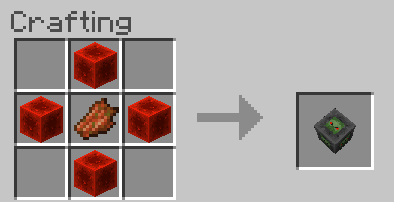|
|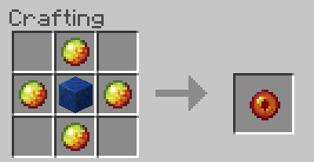|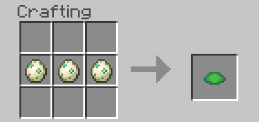|
|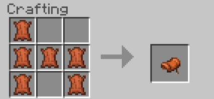|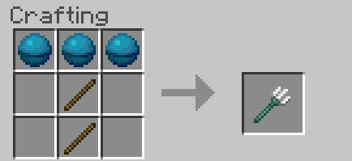|
|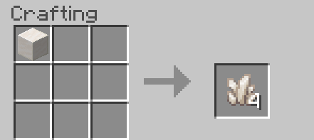||

